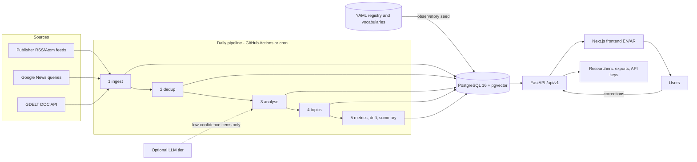

# Architecture

## Overview



The system is a batch pipeline plus a read-mostly API. There is no message queue and no
always-on worker: the pipeline runs once a day (or on demand), and every stage is
idempotent, so a crashed or repeated run never corrupts data.

## Components

| Component | Technology | Notes |
|---|---|---|
| Database | PostgreSQL 16, pgvector (HNSW, cosine), full-text `tsvector` | single source of truth; about 50 tables |
| Pipeline | Python 3.11, SQLAlchemy 2, httpx, feedparser, datasketch, rapidfuzz, scikit-learn | `observatory run` |
| NLP models | sentence-transformers, transformers (CPU), BERTopic | optional extra `[ml]`; deterministic fallback otherwise |
| LLM | Anthropic API (Claude Haiku 4.5) | optional extra `[llm]`, budgeted, cached |
| API | FastAPI, Pydantic 2, slowapi | OpenAPI at `/docs` and `/openapi.json` |
| Frontend | Next.js 16 (App Router, server components), React 19, Tailwind 4, ECharts 6 | `/en/...`, `/ar/...` with RTL |
| Automation | GitHub Actions | daily ingestion, tests, lint, build, deploy |

## Pipeline stages

Each stage only processes rows waiting for it (`articles.processing_status`) and commits
its own work. A failed stage is logged in `pipeline_errors`, later stages still run, and
the run ends `success`, `partial` or `failed` in `pipeline_runs` together with stage
statistics and the git commit.

1. **ingest** fetches every active feed in parallel (robots.txt, conditional GET,
   retries with backoff, no bypassing of access controls), parses it, filters
   general feeds for Yemen relevance, canonicalises URLs, detects language, scores
   technical completeness and stores new articles. A changed headline or excerpt
   creates an `article_versions` row. Feed and source health are updated.
2. **dedup** links exact duplicates (content hash), near duplicates (MinHash LSH on
   headlines confirmed with fuzzy matching), syndication (verbatim copies by other
   outlets, linked to the earliest copy) and same-story articles, then rebuilds story
   clusters as connected components.
3. **analyse** computes embeddings, taxonomy categories (with confidence routing),
   sentiment, emotions, tone, frames, entity and location mentions, actor-targeted
   sentiment, terminology variants and events. Results are cached by content hash.
4. **topics** assigns new articles to the current topic model and refits weekly
   (global and per top-level category), aligning topics across refits.
5. **metrics** recomputes daily aggregates for the last 14 days and any day touched
   recently, runs drift checks, and writes the bilingual daily summary.

## Data model (main tables)

```
sources ─┬─ source_feeds
         ├─ source_languages
         └─ source_orientation ── source_orientation_evidence      (A: time-bounded, evidenced)
articles ─┬─ article_versions, article_sources (sightings), article_duplicates (relations)
          ├─ article_story_clusters
          ├─ article_embeddings (vector 384, HNSW)
          ├─ category_assignments            (D: taxonomy)        ─ categories (tree)
          ├─ topic_assignments               (D: topic models)    ─ topics ─ topic_models, global_topics
          ├─ sentiment_analysis, emotion_analysis                 (B)
          ├─ framing_analysis                (C)                  ─ frames
          ├─ targeted_sentiment              (E)                  ─ entities
          ├─ entity_mentions                                       ─ entities ─ entity_aliases, locations
          ├─ event_mentions                                        ─ events ─ event_actors
          └─ claims, terminology_variants
models ─ model_versions, model_tasks, model_languages, model_benchmarks, prompt_templates, llm_calls
daily_metrics, topic_metrics, source_metrics, entity_metrics, daily_summaries, drift_reports
pipeline_runs ─ pipeline_errors
users ─ saved_queries, annotations
```

Every analysis table shares a provenance mixin: `model_version_id`, `method`
(`model | lexicon | rule | llm | human | fallback`), `confidence`, `analysis_version`,
`is_current`, `created_at`. Re-analysis marks old rows `is_current = false` instead of
deleting them.

The full schema is `backend/observatory/db/models.py`; the migration is
`backend/alembic/versions/20261002_0001_initial_schema.py`.

## API and frontend

The API is read-mostly and cacheable (`Cache-Control: public, max-age=300` on public GET
endpoints). Writes are limited to saved queries and annotations (API key) and admin
review (admin token). The frontend renders on the server and calls the API from the
server; the browser only receives HTML and public chart data, never a key.

## Security

* Secrets only in environment variables / repository secrets; `.env` is git-ignored and
  gitleaks runs in `lint.yml`.
* Admin endpoints require `X-Admin-Token` (constant-time compare) and are disabled when
  `ADMIN_TOKEN` is empty. User API keys are stored as SHA-256 hashes.
* Rate limiting, CORS allow-list, security headers (CSP, nosniff, frame denial) on both
  API and frontend; containers run as non-root users.
* All SQL uses bound parameters; CSV exports neutralise spreadsheet formulas.
